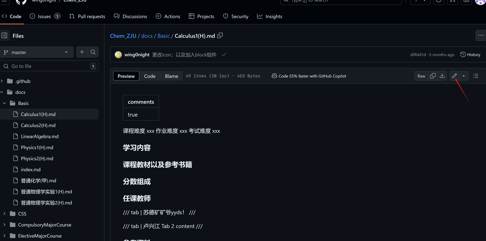
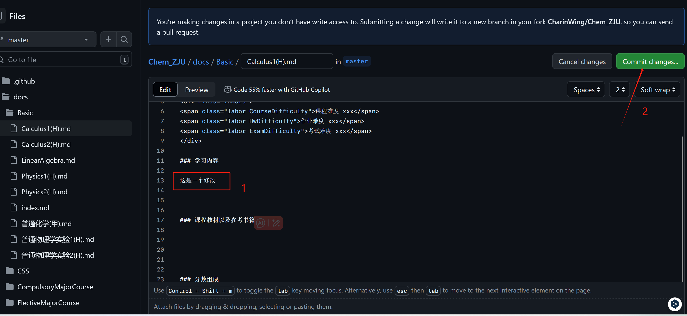

本项目contribute主要是修改和添加docs里面的md文件，欢迎同学们积极贡献呀🤩为开源体系建设出一份力~

项目地址：https://github.com/wing0night/Chem_ZJU

方法1和方法2需要先下载git。git下载，以及绑定github账号可以参考这篇blog~ https://blog.csdn.net/goog_man/article/details/94583391

## 方法1（GithubDesktop，recommended）
通过GithubDesktop完成commit（是我用的比较多的方法，使用GithubDesktop管理项目可以图形化实现推送，不同项目切换以及即时查看项目修改也很方便）

首先需要下载一个GithubDesktop。在原仓库处创建自己的fork，然后clone项目到本地（也可以选择下载zip到本地解压，然后用git进行init和添加【参考方法2】），再用GithubDesktop打开，就可以实现图形化的commit操作

详细指南可以参考b站这个教程https://www.bilibili.com/video/BV13W411U7HY/?seid=14615168054648455246&vd_source=0ce5764b2d43320613b1dd7bc3ee3031

GithubDesktop推送的本质实际上就是把git命令行的操作集成到图形化的按钮中，按下按钮就相当于在gitbash命令行中输入推送的指令

推送完成后需要在网页端创建Pull Request

## 方法2（git 命令行）
使用gitbash命令行

在项目首页下载zip到本地，解压。在解压后的文件夹中右键，选择"open GitBash here"，打开一个命令行窗口。

- 初始化本地仓库
```shell
git init
```
命令行出现"master"
- 添加变化
```shell
git add -A
```
- 将添加的变化保存到该本地仓库的记录
```shell
git commit -m "修改文件 普通化学.md"
```
后面引号中的内容是对这次commit的注释

- 将变化推送到远程仓库（完成这一步之后，github网页上的仓库内容才会改变）
```shell
git push -u 仓库名称 分支
```
这一步是推送到github服务器，所以需要科学上网环境喔

推送完成后需要创建Pull Request（PR），这样项目管理者可以看到你的修改并merge到主要分支中

## 方法3（适合初学者尝试推送过程）
直接在github网页进行修改和commit

适合入门的同学很方便地进行修改尝试，但是直接使用github网页的编辑器，而且点击跳转速度没有VSCode等编辑器快，界面也不是很人性化，所以有长期commit意愿的同学可以优先考虑上面两种~

fork项目到自己的repositories中，进入docs文件夹，比如想要修改Basic栏目的Calculus1(H).md


可以在这个地方点击edit

然后修改内容



修改完成后可以创建一个pull request，这样仓库管理者就可以在他们自己那里看到你的PR，并添加到主要分支中。这个时候github page自动实现部署，你的修改就可以在网页上看到啦~


在仓库所有者端可以merge pull request

